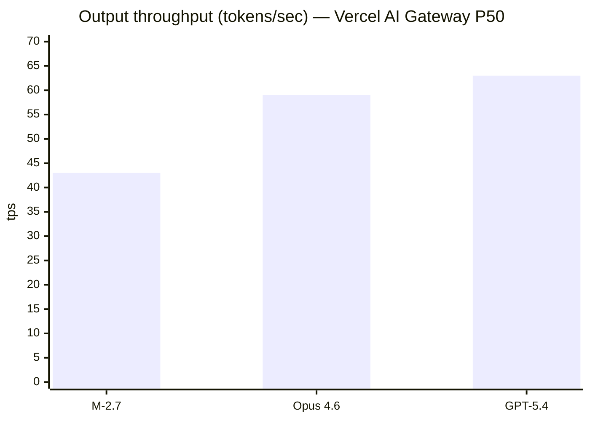
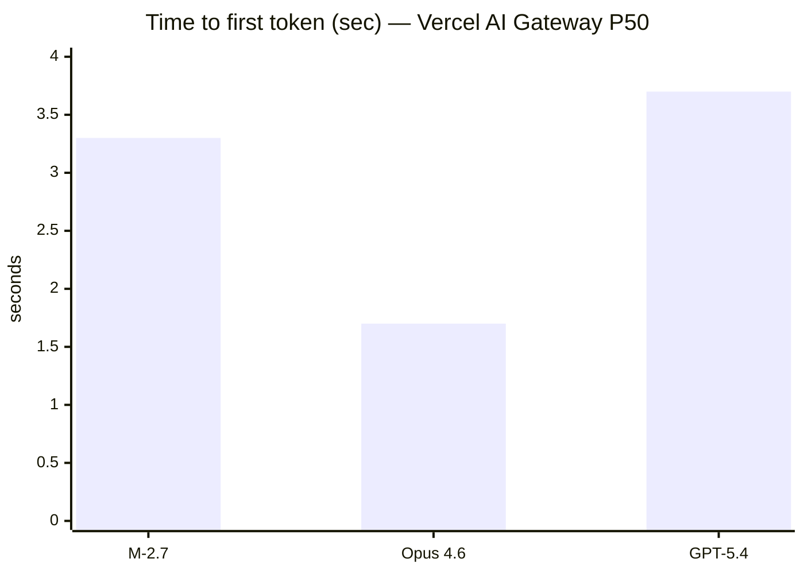

# MiniMax M-2.7 as a Third Model in a Multi-Model AI Coding Workflow

## Executive summary

MiniMax M-2.7 is compelling as a **third model** in your workflow primarily because it offers **near–frontier “agentic coding” capability at an order-of-magnitude lower token cost** than Claude Opus 4.6 and GPT‑5.4, while still supporting mainstream SDK ecosystems (OpenAI- and Anthropic-compatible APIs) that make it easy to plug into existing tools. citeturn5view3turn4search0turn4search1

The highest-leverage way to use M-2.7 is **not** as your “executor” (where Codex+GPT‑5.4 already shines because it can read/edit files and run commands safely inside an agent environment), but as your **high-volume, low-cost** engine for (a) *first-pass* work (drafting, scanning, summarizing, proposing diffs) and (b) *bulk* work (boilerplate, repetitive refactors, test scaffolds, doc generation), handing off to GPT‑5.4/Codex for verification and execution. citeturn3search4turn3search8turn24view0turn5view3

The main risks and frictions you must design around are:

- **Tool-calling / “reasoning” formatting quirks:** M-2.7 can embed reasoning in `<think>` tags or split it into a dedicated field; it also requires that you preserve full message objects across tool-use turns to maintain reasoning continuity. This is powerful but easy to integrate incorrectly. citeturn13view0turn5view6  
- **IDE/agent integration maturity:** MiniMax’s own docs explicitly warn that running M-2.7 inside Codex CLI is “not recommended” (compatibility issues; version pinning). In practice, M-2.7 fits better as a provider inside Claude Code / OpenCode-style toolchains (read-only or gated modes). citeturn6view8turn5view1  
- **Privacy / retention uncertainty (vendor-direct):** Some ecosystems (e.g., Vercel AI Gateway) label MiniMax endpoints as ZDR/no-training, but the first-party Open Platform privacy policy text was not retrievable in this run, so for risk-sensitive repos you should assume **policy ambiguity** until you validate contractually and empirically. citeturn19view1turn8search4  

A concise “default routing” that matches your stated architecture:

- **Architecture & hard reasoning:** Claude Opus 4.6 (keep as-is). citeturn20search21turn12view4  
- **Execution / repo edits + tests:** OpenAI Codex (GPT‑5.4) (keep as-is). citeturn3search4turn3search8turn5view14  
- **Add M-2.7 for:** low-cost, long-context *analysis + drafting* stages, plus bulk mechanical changes—then “prove” with GPT‑5.4/Codex. citeturn5view3turn24view0turn14search2  

## Model and platform facts that matter

### Core API economics, context, and caching

The table below uses **official vendor pricing** wherever available; where MiniMax does not specify a number (e.g., max output for M-2.7) it is marked **unspecified** and sourced from reputable tool/provider documentation as an estimate.

| Model | Context window | Max output tokens | Standard input price (USD / 1M tok) | Standard output price (USD / 1M tok) | Prompt caching / cached input | Notes |
|---|---:|---:|---:|---:|---|---|
| MiniMax M-2.7 | 204,800 | **Unspecified (vendor)**; widely reported ~131,072 | 0.30 | 1.20 | Read 0.06 / Write 0.375 | Anthropic-compatible endpoint recommended by MiniMax; “highspeed” variant exists. citeturn4search1turn5view3turn14search3 |
| Claude Opus 4.6 | 1,000,000 | 128,000 | 5.00 | 25.00 | Cache hits 0.50; writes 6.25 (5m) / 10 (1h) | Full 1M context is billed at standard per-token rates (current docs). citeturn17view0turn16view0turn25view1 |
| GPT‑5.4 | 1,050,000 | 128,000 | 2.50 | 15.00 | Cached input 0.25 | Prompts >272K input tokens incur higher pricing multipliers (see note below). citeturn15view2turn12view10turn15view0 |

**Important nuance for GPT‑5.4 “1M context”:** OpenAI’s model page indicates a 1.05M context window, but applies a pricing step-up when the prompt exceeds 272K input tokens (2× input and 1.5× output “for the full session”). This matters if you plan to use GPT‑5.4 for very large repos or large multi-doc bundles; M-2.7 and Opus 4.6 do not advertise the same “>272K surcharge” mechanic in their first-party tables. citeturn15view0turn16view0

### Latency and throughput in practice (measured, third-party)

End-to-end speed is workload-dependent (prompt size, output size, reasoning depth), and providers differ. A useful, *consistent* external reference is **Vercel AI Gateway**, which publishes P50 latency and throughput based on live traffic. citeturn20search26turn19view0turn25view1turn25view4

| Model (provider row) | P50 time-to-first-token | P50 output throughput |
|---|---:|---:|
| MiniMax M-2.7 (MiniMax via AI Gateway) | 3.3 s | 43 tps citeturn19view0 |
| Claude Opus 4.6 (Anthropic via AI Gateway) | 1.7 s | 59 tps citeturn25view1 |
| GPT‑5.4 (OpenAI via AI Gateway) | 3.7 s | 63 tps citeturn25view4 |

MiniMax separately describes M-2.7 output speed as ~60 tps (and “highspeed” ~100 tps) in its Anthropic-compatible model list; real-world measured throughput can be lower depending on provider/infrastructure and request characteristics. citeturn4search1turn19view0





### Tool/IDE integration realities

Your three-model concept (“Opus reasons, GPT‑5.4 executes, M-2.7 adds value”) is strongly shaped by tooling:

- **Codex (GPT‑5.4)** is explicitly designed to **read/edit files and run commands** with permission modes (Auto / read-only / full access). This is a core reason it’s well-suited for “execution.” citeturn3search4turn3search8turn3search10  
- **Claude Code** has a mature **permissions rule system** (allow/ask/deny), plus an “auto mode” intended to reduce repetitive approvals while managing approval fatigue. citeturn3search7turn5view13turn3search36  
- **MiniMax M-2.7** integrates best as a **provider model** in existing agent/IDE frameworks via compatibility endpoints:
  - OpenAI-compatible API format. citeturn4search0  
  - Anthropic-compatible API format (with caveats; see below). citeturn4search1  
  - MiniMax’s own “AI Coding Tools” guide recommends using M-2.7 in Claude Code and shows configuration examples; it explicitly flags Codex CLI usage as “not recommended” due to compatibility issues and suggests pinning to an older Codex CLI version. citeturn6view8turn5view2  

image_group{"layout":"carousel","aspect_ratio":"16:9","query":["MiniMax AI logo","Anthropic Claude logo","OpenAI Codex logo","Vercel AI Gateway logo"],"num_per_query":1}

## Evidence base and what the benchmarks do and do not prove

### Benchmark primitives most relevant to engineering workflows

A practical reading of “software engineering performance” typically decomposes into (a) **issue resolution in real repos**, and (b) **agentic execution in environments** (terminal/browser/tools).

- **SWE-bench** introduced a framework of real GitHub issues mapped to patches validated by tests, on 2,294 problems across 12 popular Python repositories. citeturn22search0turn22search8  
- **SWE-bench Verified** is a human-validated subset intended to improve reliability of evaluation. citeturn22search16turn22search4  
- **SWE-Bench Pro** (2025) explicitly targets longer-horizon, enterprise-like tasks across a larger and more diverse set of repositories (1,865 problems, 41 repos), with design choices intended to reduce contamination and raise difficulty. citeturn22search2turn22search10  
- **Terminal-Bench 2.0** (2026) targets “hard, realistic tasks in command line interfaces” (89 tasks) and provides a harness for agent benchmarking. citeturn22search1turn22search13  

These benchmark families are the best-supported “primary sources” for comparing *agentic coding* capability across models.

**Benchmark caveat (load-bearing):** multiple papers and analyses argue that standard SWE-bench variants can be affected by leakage or weak tests; this is precisely why “Verified,” “Pro,” and newer variants exist, and why you should resist overfitting routing rules to a single leaderboard. citeturn22search28turn22search32turn22search2  

### What each vendor publicly claims on engineering-like evaluations

**MiniMax M-2.7 (vendor-reported):** MiniMax positions M-2.7 as a model that “deeply participat[ed] in its own evolution,” with strong “real-world software engineering” performance; it reports:
- SWE-Pro 56.22%
- VIBE-Pro 55.6%
- Terminal Bench 2 57.0% citeturn24view0  

MiniMax also reports an “MM Claw” evaluation set aligned to OpenClaw tasks and states 62.7% accuracy “close to Sonnet 4.6” (vendor-defined metric). citeturn24view1  

**GPT‑5.4 (vendor-reported, public table):** OpenAI publishes a table including:
- SWE-Bench Pro (Public) 57.7%
- Terminal-Bench 2.0 75.1% citeturn12view9turn5view14  

OpenAI additionally frames GPT‑5.4 as combining GPT‑5.3‑Codex coding strengths with stronger tool use and professional workflows. citeturn23search0turn15view2  

**Claude Opus 4.6 (vendor qualitative):** Anthropic’s release note emphasizes improved careful planning, longer-sustained agentic tasks, better reliability in larger codebases, and improved code review/debugging to catch mistakes—without publishing a single canonical “SWE-Pro-like” number in the release post excerpt available here. citeturn20search21turn12view7  

### Third-party evaluations that are especially useful for routing

- **Vercel AI Gateway** is helpful for *latency/throughput/pricing comparability* because it reports per-model/provider metrics from live traffic. citeturn20search26turn25view1turn25view4turn19view0  
- **Artificial Analysis** (third-party) reports that MiniMax M-2.7 improved hallucination-related behavior (AA-Omniscience Index +1; “hallucination rate 34%”), and improved on “real-world agentic tasks” (GDPval-AA Elo 1494) relative to M2.5—useful signals if you want cheaper “drafting” and “triage” stages without a collapse in truthfulness. citeturn24view7  
- For *end-to-end app build* evaluation, newer benchmarks such as **Vibe Code Bench** attempt to measure the full “zero-to-one” workflow via browser-verified tasks. citeturn23search26  

## Task-by-task strengths, weaknesses, and prompt patterns for M-2.7

The comparisons below assume your workflow intent: **Opus = architecture/reasoning**, **GPT‑5.4/Codex = execution**, **M-2.7 = third model** optimized for cost-efficient throughput across repetitive or analysis-heavy work.

A practical way to read each task is:
- Use M-2.7 for **drafting + breadth-first scanning**.
- Use Opus 4.6 for **depth-first reasoning** (especially when stakes are high and ambiguity is large).
- Use GPT‑5.4/Codex for **actions + verification** (tests, builds, refactors applied in-repo).

### Code review

**Accuracy/quality:**  
Claude Opus 4.6 is explicitly positioned by Anthropic as improved at code review and debugging, including catching its own mistakes, and more reliable in larger codebases. citeturn20search21turn12view7  
M-2.7 can be effective for first-pass “wide” review—scanning diffs for style, logic smells, missing tests, and log/observability concerns—at very low cost. citeturn24view0turn5view3  
GPT‑5.4 becomes strongest when you want the review to immediately become *actionable changes + test runs* inside Codex. citeturn3search4turn5view14  

**Reliability/consistency:**  
M-2.7’s “interleaved thinking” requires careful message-history handling; if your toolchain drops `<think>` content or `reasoning_details`, multi-turn review threads can degrade. citeturn13view0turn5view6  
Codex/Claude Code have explicit permission and workflow controls that reduce accidental destructive behavior; the *model* is not the whole story. citeturn3search4turn3search7turn5view13  

**Latency & cost-efficiency:**  
M-2.7 is far cheaper per token than Opus 4.6 and GPT‑5.4 (roughly 8–17× cheaper on input, ~12–21× cheaper on output), so you can afford to run multiple review passes (e.g., “correctness pass,” “security pass,” “performance pass”) and then escalate only the tricky findings. citeturn5view3turn17view0turn12view10  

**Context-window constraints:**  
M-2.7’s ~205K context is often enough for a sizeable diff + surrounding files, but it is materially smaller than Opus/GPT‑5.4’s ~1M-class windows. citeturn4search1turn15view2turn20search21  

**Hallucination risk:**  
Third-party analysis suggests M-2.7 is trending toward *abstention rather than guessing* (lower hallucination rate than some peers noted in that analysis). Still, code review hallucinations often manifest as “confident but false” claims about behavior—so require evidence (file paths, line numbers, concrete traces). citeturn24view7turn22search28  

**Safety/privilege concerns:**  
For code review, you can keep M-2.7 in a read-only posture (no tool execution) and only allow Codex/Claude Code to apply patches after explicit approval gates. citeturn3search4turn3search7turn5view13  

**M-2.7 prompt pattern (review as “evidence-indexed findings”):**
```text
Role: Senior reviewer. Task: review the diff + impacted codepaths.
Constraints:
- Cite file paths and (approx) line ranges for every finding.
- Classify each finding: correctness | security | perf | reliability | style.
- For each finding: give (a) risk, (b) concrete fix suggestion, (c) test to add.

Input:
1) PR description:
2) git diff:
3) key files (optional):
4) runtime logs (optional):

Output:
- Findings table
- Minimal patch plan (no code yet)
- “Escalate to executor” checklist (what to run in Codex)
```
Mitigation for M-2.7: keep temperature low but **>0** (MiniMax Anthropic-compat lists a temperature range (0.0, 1.0]). citeturn4search1  

### Test generation

**Accuracy/quality:**  
Test generation quality depends on (a) API/behavior understanding and (b) ability to anticipate edge cases. Opus 4.6 is a strong “reasoning” choice for defining invariants and high-value edge cases; M-2.7 is a strong cost choice for producing broad test scaffolding; GPT‑5.4/Codex is best when the loop includes running tests and iterating until passing. citeturn20search21turn3search4turn24view0  

**Reliability & hallucination risk:**  
All models can hallucinate APIs. Reduce by requiring tests to be derived from *actual signatures* (paste code or generate from introspection), and by demanding executor verification. Benchmark work on “vibe coding” emphasizes that end-to-end validation matters because partial correctness can still ship vulnerabilities or regressions. citeturn23search2turn22search1  

**Latency & cost:**  
M-2.7 is ideal for generating large volumes of table-driven tests cheaply, then you can use Codex to run/repair. citeturn5view3turn3search4  

**Tool/IDE integration:**  
Codex is explicitly designed to run local commands in a constrained environment (sandbox) and ask for approvals for broader actions; this makes it well-suited to test execution loops. citeturn3search8turn3search10turn3search4  

**M-2.7 prompt pattern (tests as “hypothesis list + scaffold”):**
```text
Generate tests for <module/function>. Target: high bug-finding power.

You MUST:
1) List behaviors/invariants (bullet list).
2) Enumerate edge cases as a table: case | input | expected | why it matters.
3) Produce test code (framework: <pytest/jest/etc>).
4) Add TODO markers where runtime environment knowledge is required.

Inputs:
- code under test (paste)
- expected behavior / spec
- existing tests (paste if any)
```

### Refactoring

**Accuracy/quality:**  
Refactoring is where M-2.7 can add major value if you frame it as **mechanical transformation + minimal semantics risk** (rename, extraction, formatting, typing, minor API cleanup) and then validate in Codex. MiniMax’s own model overview repeatedly emphasizes “precision code refactoring” in the M2.x family, and M-2.7 is positioned as “top real-world engineering.” citeturn14search0turn24view0turn5view3  

**Reliability/consistency:**  
Refactors often become inconsistent—especially across multiple files—unless you enforce constraints like “single responsibility, no behavior change,” “keep public API stable,” “limit diff size per step.” This is more about process than model, but M-2.7’s low cost enables a “propose-refactor plan → review plan → generate patch” loop without budget anxiety. citeturn5view3turn14search2  

**Tool integration:**  
MiniMax explicitly warns that using M-2.7 through Codex CLI is not best practice; in practice, keep M-2.7 as a “planner/refactor suggester” and let Codex apply patches and run tests. citeturn6view8turn3search4  

**M-2.7 prompt pattern (refactor as staged patches):**
```text
Refactor goal: <goal>. Hard constraints:
- No behavior change (unless specified).
- Keep public signatures stable.
- Make at most N files change per patch.
- Provide a migration note if any external behavior changes.

Deliver:
A) Refactor plan (ordered steps, with file list per step)
B) For step 1 only: patch-style output (unified diff)
C) Tests to run in executor after step 1
```

### Documentation

**Accuracy/quality:**  
Documentation often fails on factual correctness (what the code actually does), not prose quality. Opus 4.6 is strong for higher-level explanation and narrative cohesion; M-2.7 is attractive for bulk doc generation (API docs, READMEs, change logs) when you feed it the actual code and require citations to symbols. citeturn20search21turn24view0turn4search1  

**Cost-efficiency:**  
Docs can be token-heavy because you include large code excerpts; M-2.7’s pricing makes “include more context” cheap. citeturn5view3turn17view0turn12view10  

**Tool integration:**  
MiniMax provides explicit guidance to configure Claude Code for documentation workflows and suggests project-level instruction files (e.g., CLAUDE.md-like) for consistent doc style. citeturn11search13turn3search7  

**M-2.7 prompt pattern (docs as symbol-indexed, non-hallucinated):**
```text
Write documentation ONLY for what is present in the provided code.
Rules:
- Every claim must reference an actual symbol (class/function/config key).
- If something is unclear, write “Unknown from provided code”.
- Output format: Markdown with sections: Overview, Key APIs, Examples, Gotchas.

Inputs:
- Code + config files
- Example usage (if available)
```

### Boilerplate generation

**Accuracy/quality:**  
Boilerplate (CRUD endpoints, DTOs, wiring, config, scaffolding) is where M-2.7 is most likely to be a net win: the work is high-volume and repetitive, and correctness can be validated cheaply by compilation/tests. MiniMax’s model positioning stresses “end-to-end full project delivery” and “professional office delivery,” which aligns with generating consistent project scaffolds. citeturn24view0turn12view0  

**Latency & cost:**  
M-2.7’s per-token costs enable larger “generate the whole module” outputs at low expense; if you need faster iterations, the “highspeed” option exists but at 2× price. citeturn5view3turn4search1turn19view0  

**M-2.7 prompt pattern (scaffold with explicit contract):**
```text
Generate boilerplate for <feature>. You MUST:
- Start with a file tree + brief purpose per file.
- Provide code in file-separated blocks with exact paths.
- Include TODOs for integration points you cannot infer.
- Include a “how to verify” section (commands to run).

Constraints:
- Language/framework versions: <...>
- Formatting/linting: <...>
- Security: no secrets, no hardcoded tokens.
```

### Bug triage

**Accuracy/quality:**  
Bug triage combines log analysis, hypothesis generation, and “what to try next.” MiniMax explicitly calls out “log analysis” and “bug troubleshooting” as strengths for M-2.7, and it’s cost-effective enough to run multiple hypotheses in parallel (e.g., “infra”, “race condition”, “API contract drift”). citeturn24view0turn5view3  

**Reliability:**  
Triage is fragile if the model invents context. Require it to (a) cite evidence from logs, and (b) output experiments that produce decisive evidence. Terminal-agent benchmarks exist because “run the commands” is materially harder than “suggest the commands.” That division maps well to your split: triage with M-2.7/Opus, execute with Codex. citeturn22search1turn3search4turn3search8  

**M-2.7 prompt pattern (triage as hypothesis tree + experiment plan):**
```text
You are debugging. Use only provided artifacts.

Inputs:
- error logs
- recent diff / release notes
- environment details
- reproduction steps (if any)

Output:
1) Symptom summary (quote log lines)
2) Hypothesis tree (top 5 causes, ranked)
3) For each hypothesis: 1-2 experiments with exact commands and expected outcomes
4) Minimal patch suggestion (if confident) + tests to run in executor
```

### Code explanation

**Accuracy/quality:**  
Code explanation is often best when the model can sustain a coherent mental model across multiple files. Opus 4.6’s release positioning emphasizes deeper codebase understanding and longer agentic focus; M-2.7’s 205K context is still large enough to explain moderately sized subsystems cheaply when you chunk inputs carefully. citeturn20search21turn4search1turn14search2  

**Hallucination risk:**  
Require the explainer to reference exact identifiers and refrain from speculation; M-2.7’s “reasoning split” mode can help keep internal reasoning separate, but you should still enforce “no invented APIs.” citeturn13view0turn5view6turn24view7  

**M-2.7 prompt pattern (explanation as “call graph + invariants”):**
```text
Explain how <feature> works, strictly from provided code.
Deliver:
- Architecture sketch (components + responsibilities)
- Data flow (inputs → transforms → outputs)
- Key invariants and failure modes
- Where to add logs/metrics
- “If you change X, what breaks?” list
```

## Routing recommendations and concrete workflow design

### Routing table by quality vs cost

Confidence reflects (a) strength of primary-source support, and (b) how sensitive the task is to tool execution and hidden context.

| Task | Preferred model (quality-first) | Preferred model (cost-first) | Rationale | Confidence |
|---|---|---|---|---|
| Code review | Claude Opus 4.6 | M-2.7 (then escalate) | Opus is explicitly improved for code review/debugging; M-2.7 is cheap enough for multi-pass scanning, then Opus/Codex handles contentious findings. citeturn20search21turn12view7turn5view3 | Medium-High |
| Test generation | GPT‑5.4 in Codex (end-to-end) | M-2.7 drafts + GPT‑5.4 verifies | Execution loop (run tests, iterate) is decisive; M-2.7 is great for scaffolds and edge-case enumeration. citeturn3search4turn3search8turn5view3 | High |
| Refactoring | GPT‑5.4 in Codex | M-2.7 for mechanical refactors + GPT‑5.4 validates | MiniMax emphasizes refactoring, but safe refactors require compile/test verification; Codex permissioned execution is a strong fit. citeturn14search0turn3search4turn6view8 | High |
| Documentation | Claude Opus 4.6 | M-2.7 | Opus excels for coherent narrative and reasoning; M-2.7 is extremely cost-efficient for bulk docs when grounded in code. citeturn20search21turn5view3turn12view0 | Medium |
| Boilerplate generation | GPT‑5.4 (when immediately executed) | M-2.7 | For scaffolds that must compile/work immediately, Codex loop wins; for bulk repetitive boilerplate, M-2.7 is cheapest. citeturn3search4turn5view3turn24view0 | Medium |
| Bug triage | Claude Opus 4.6 (root-cause reasoning) + GPT‑5.4 (prove) | M-2.7 (triage) + GPT‑5.4 (prove) | MiniMax claims strength in log analysis/bug troubleshooting; pairing with executor is key for confirmation. citeturn24view0turn3search4turn3search8 | Medium |
| Code explanation | Claude Opus 4.6 | M-2.7 | Explanation benefits from deep reasoning; M-2.7 is a cost-efficient explainer if you enforce symbol-grounded outputs. citeturn20search21turn5view3turn13view0 | Medium |

### A concrete multi-model routing flow

```mermaid
flowchart TD
  A[Developer request arrives] --> B{Task category}
  B -->|Architecture / ambiguous specs| O[Opus 4.6]
  B -->|Bulk drafting / scanning| M[M-2.7]
  B -->|Repo edits + tests / execution| C[Codex (GPT-5.4)]

  O --> D[Produces: plan, invariants, acceptance tests]
  M --> E[Produces: drafts, findings, patch proposals]
  D --> C
  E --> C

  C --> F{Verification}
  F -->|Tests pass / build green| G[Ship PR + summary]
  F -->|Fails| H[Iterate: send failures back]
  H --> O
  H --> M
  H --> C
```

### Integration recommendations that reduce operational pain

- **Keep M-2.7 out of Codex CLI operationally** unless you are willing to manage compatibility/version pinning; MiniMax explicitly warns about Codex CLI compatibility and recommends an older Codex CLI version. citeturn6view8turn6view9  
- **Prefer M-2.7 via the Anthropic-compatible endpoint** when using Claude Code–style tools; MiniMax documents this as the recommended approach and provides setup instructions. citeturn4search1turn5view1  
- **Use “reasoning_split” for M-2.7** when you control the client, to avoid tool parsers breaking on `<think>` tags embedded inside content. Integrations that assume OpenAI-style JSON tool calls can fail if tool-call data is embedded differently (community reports exist). citeturn13view0turn4search11  
- **Treat permissions as model-agnostic:** the biggest real-world failures in coding agents come from over-broad execution privileges. Codex and Claude Code both provide explicit permission modes/rules; your routing should preserve a “review gate” before any write+run step outside the workspace. citeturn3search4turn3search7turn5view13turn3search10  

## Open questions and experiments to validate routing in your environment

### Open questions you should resolve before relying on M-2.7 for sensitive repos

- **Data policy clarity (vendor-direct):** establish (contractually, not just via aggregators) whether prompts/completions are retained, for how long, and whether they are used for training; community discussion shows uncertainty here. citeturn8search4turn19view1  
- **Tool-call robustness across your chosen IDE/agent stack:** M-2.7 supports tool use, but compatibility layers may ignore certain Anthropic parameters (e.g., stop sequences, top_k, service_tier…) and require strict history preservation; you should confirm tool calls behave deterministically in your environment. citeturn4search1turn13view0turn5view6  
- **Long-context degradation behavior:** Opus 4.6 and GPT‑5.4 offer ~1M context; M-2.7 offers ~205K. You should test your codebase sizes and retrieval/chunking strategies to see when M-2.7 stops being “enough.” citeturn4search1turn15view2turn20search21  

### Recommended experiment suite

Design these as **A/B/C tests** (Opus vs GPT‑5.4 vs M-2.7), but measure *end-to-end success* rather than “pretty output.”

**Repository task battery (functional correctness):**
- Use a curated set of tasks resembling SWE-bench / SWE-Bench Pro patterns: real issues, multi-file edits, tests as oracle. citeturn22search0turn22search2  
- Metrics:
  - Pass rate (tests green)
  - Iterations to green
  - Wall-clock time (TTFT, end-to-end)
  - Token usage and cost (including caching)
  - Diff size (lines changed) and churn (files touched)

**Code review accuracy study (precision/recall):**
- Sample ~50 historical PRs with known post-merge bugs or security findings.
- Have each model:
  1) Review the PR diff only,
  2) Review diff + surrounding files,
  3) Review plus CI logs.
- Score against a human-labeled rubric:
  - True positives (real issues found)
  - False positives (invented or irrelevant)
  - Severity calibration (does it over/under-rate?)

**Test generation quality via mutation testing:**
- For each generated test suite, run mutation testing (or fault seeding):
  - Mutation score / kill rate
  - Coverage increase
  - Flakiness rate over repeated runs
- This directly addresses a known risk: “tests that look good but don’t constrain behavior.”

**Refactor safety evaluation:**
- Define refactors with a stable public API guarantee.
- Metrics:
  - Behavioral equivalence via golden tests
  - Performance regression (benchmarks)
  - Lint/type-check cleanliness

**Agent privilege red-team (safety/permissions):**
- Run each executor workflow (Codex/Claude Code) with:
  - read-only mode,
  - default auto mode,
  - full access (only in sandboxed disposable repos).
- Inject prompt-injection strings into code comments, error logs, and docs to see whether the agent attempts unsafe actions.
- Evaluate whether your approval gates catch misbehavior; this matters because GPT‑5.4 is treated as high cyber capability and deployed with additional safeguards in OpenAI’s own framing. citeturn5view15turn3search4turn5view13  

**Minimum metrics to collect across all experiments**
- Success (binary): tests pass / issue resolved / doc accurate
- Cost: input/output tokens, caching hits, tool-call fees (if any)
- Latency: TTFT, total time, throughput under streaming
- Consistency: variance over N=5 runs per task (same seed/settings if supported)
- Human satisfaction: quick 1–5 score for readability, maintainability, and trustworthiness

If you adopt this battery, you can turn routing from “opinionated heuristics” into a **data-backed policy**—and you can update it as vendors ship new snapshots and pricing changes. citeturn15view2turn20search26turn16view0