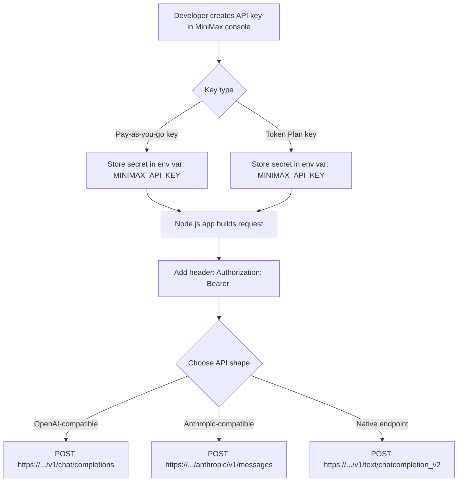

# Integrating MiniMax M-2.7 into a Node.js Workflow

## Executive summary

MiniMax M‑2.7 can be integrated into a Node.js stack through three “officially blessed” HTTP shapes: an OpenAI-compatible API (`/v1`), an Anthropic-compatible API (`/anthropic`), and a native MiniMax text endpoint (`/v1/text/chatcompletion_v2`). The OpenAI- and Anthropic-compatible interfaces are explicitly documented as compatibility layers intended to let you use existing ecosystem SDKs with only a base URL + API key change. citeturn20view0turn20view1turn1view1

Authentication for direct MiniMax API access is API-key based: you create a Pay‑as‑you‑go key or a Token Plan key, and send it as an HTTP `Authorization: Bearer <API_KEY>` header. Token Plan keys are explicitly described as not interchangeable with Pay‑as‑you‑go keys and valid only during an active subscription period. citeturn1view1turn20view3turn5search17

For agentic coding workflows, MiniMax emphasizes “interleaved thinking” and tool/function calling. In practice this means: (1) supply tool definitions (`tools`) and potentially `tool_choice`, (2) preserve the assistant’s full response in your conversation history—including tool calls and reasoning fields—when you send the next turn, and (3) optionally enable a MiniMax-specific `reasoning_split` flag (passed via “extra body” fields in OpenAI-style calls) to separate reasoning into a structured `reasoning_details` field instead of embedding it inside `<think>...</think>` tags in `content`. citeturn20view0turn4view3

Streaming is supported across all major compatibility endpoints (OpenAI SDK streaming and Anthropic SDK streaming are both shown), and it follows the mainstream server‑sent-events (SSE) / chunked streaming pattern used by OpenAI compatible APIs. OpenRouter additionally documents SSE “comment” frames that may appear in streams and recommends robust parsers like `eventsource-parser`—a practical recommendation for Node.js consumers. citeturn20view0turn20view1turn18view3

Regarding aggregators: OpenRouter lists MiniMax M2.7 as an available model (released 2026‑03‑18 on that platform) and offers an OpenAI-compatible `chat/completions` endpoint. Together AI’s public “Serverless Models” list shows MiniMax M2.5 (not M2.7) as of the captured documentation, so M2.7 availability there is **not listed / unspecified**. Fireworks AI shows MiniMax‑M2 and MiniMax‑M2.5 model pages and provides an OpenAI-compatible inference base URL; a Fireworks-hosted M2.7 listing was **not found in the captured sources**, so M2.7 availability there is **unspecified**. citeturn10view2turn18view0turn13view0turn13view2turn10view1turn15search0

## Official endpoints and authentication

### Endpoint matrix

The most important architectural choice is which API “shape” you want to speak from Node.js: OpenAI, Anthropic, or native MiniMax. MiniMax documents both OpenAI and Anthropic compatibility explicitly, including environment variables and supported model IDs. citeturn20view0turn20view1

| Interface style | International base URL | China mainland base URL | Primary chat endpoint | Recommended Node integration | Streaming | Notes |
|---|---:|---:|---|---|---|---|
| OpenAI-compatible | `https://api.minimax.io/v1` | `https://api.minimaxi.com/v1` | `POST /chat/completions` (OpenAI SDK style) | Use OpenAI SDK or REST | Yes | Supports MiniMax models including `MiniMax-M2.7`; add `extra_body: {"reasoning_split": true}` for structured reasoning. citeturn20view0turn6view1 |
| Anthropic-compatible (recommended by MiniMax) | `https://api.minimax.io/anthropic` | `https://api.minimaxi.com/anthropic` | `POST /v1/messages` (Anthropic SDK style) | Use Anthropic SDK | Yes | MiniMax explicitly lists M‑2.7 (and highspeed variants) as supported via this interface. citeturn20view1turn6view1 |
| Native MiniMax text endpoint | `https://api.minimax.io` | `https://api.minimaxi.com` (implied by other docs’ region pattern) | `POST /v1/text/chatcompletion_v2` | REST (fetch/axios) | Yes (multi-chunk) | MiniMax model marketing page shows M2.7 calling this endpoint; separate “Text Generation” doc marks the SDK-style “Text Generation” guide as deprecated, but the endpoint itself is still referenced. citeturn15search10turn2view0turn1view1 |

### Authentication primitives

#### API keys

MiniMax API endpoints in the official API reference use HTTP Bearer authentication:
- Header: `Authorization: Bearer <API_key>`  
- `Content-Type: application/json` for JSON endpoints. citeturn1view1turn5search3

MiniMax documents two billing-linked API key types:
- **Pay-as-you-go**: created as a “new secret key”.
- **Token Plan**: created as a “Token Plan Key”; it is explicitly exclusive to Token Plan, not interchangeable with Pay-as-you-go keys, and valid only while the subscription is active. citeturn5search17turn20view3turn6view1

#### OAuth (documented for OpenClaw setup, but not as the general API auth mechanism)

For a specific AI coding tool onboarding flow (OpenClaw), MiniMax’s docs instruct users to select a “MiniMax Global — OAuth (minimax.io)” authentication method and then sign in + authorize in a browser. However, MiniMax does **not** publish (in the captured OpenClaw documentation) the underlying OAuth endpoints, scopes, token formats, refresh mechanics, or headers used after authorization. Treat those details as **unspecified** unless you can inspect OpenClaw’s implementation or an official OAuth reference. citeturn6view0turn6view1

### Authentication flow diagrams



The key “hard requirement” for robust multi-turn tool use is that you preserve the full assistant response object (including tool calls and reasoning fields) in history before the next call. MiniMax calls this out in both OpenAI and Anthropic compatibility docs. citeturn20view0turn20view1

## Node.js integration patterns, retries, and rate limits

### Official-SDK approach

MiniMax’s own “Integrate via SDK” quickstart explicitly recommends using the Anthropic SDK to call `MiniMax-M2.7`. citeturn20view2  
MiniMax also provides a dedicated “Compatible OpenAI API” page showing how to point the OpenAI SDK at MiniMax by setting `OPENAI_BASE_URL` and `OPENAI_API_KEY`. citeturn20view0

#### OpenAI SDK (Node.js) against MiniMax OpenAI-compatible endpoint

> **Install**: `npm i openai`

```js
// file: minimax-openai-sdk.js
import OpenAI from "openai";

const client = new OpenAI({
  // MiniMax OpenAI-compatible base URL:
  // International: https://api.minimax.io/v1
  // China: https://api.minimaxi.com/v1
  baseURL: process.env.OPENAI_BASE_URL ?? "https://api.minimax.io/v1",
  apiKey: process.env.OPENAI_API_KEY, // set to your MiniMax API key
});

async function main() {
  const resp = await client.chat.completions.create({
    model: "MiniMax-M2.7",
    messages: [
      { role: "system", content: "You are a careful, concise assistant." },
      { role: "user", content: "Summarize the main engineering risks of SSE streaming." },
    ],
    // MiniMax-specific: split reasoning into reasoning_details instead of <think> tags.
    extra_body: { reasoning_split: true },
  });

  const msg = resp.choices[0].message;
  console.log("TEXT:", msg.content);
  console.log("REASONING_DETAILS:", msg.reasoning_details ?? null);
}

main().catch((e) => {
  console.error(e);
  process.exit(1);
});
```

MiniMax documents the `OPENAI_BASE_URL=https://api.minimax.io/v1` and `OPENAI_API_KEY=<YOUR_API_KEY>` configuration and shows `extra_body={"reasoning_split": True}` for interleaved thinking output separation. citeturn20view0turn4view3

#### Anthropic SDK (Node.js) against MiniMax Anthropic-compatible endpoint

> **Install**: `npm i @anthropic-ai/sdk`

```js
// file: minimax-anthropic-sdk.js
import Anthropic from "@anthropic-ai/sdk";

const client = new Anthropic({
  apiKey: process.env.ANTHROPIC_API_KEY, // set to your MiniMax API key
  // International: https://api.minimax.io/anthropic
  // China: https://api.minimaxi.com/anthropic
  baseURL: process.env.ANTHROPIC_BASE_URL ?? "https://api.minimax.io/anthropic",
});

async function main() {
  const message = await client.messages.create({
    model: "MiniMax-M2.7",
    max_tokens: 500,
    system: "You are a helpful assistant.",
    messages: [{ role: "user", content: [{ type: "text", text: "Hello—what can you do?" }] }],
  });

  // Anthropic-style content blocks may include thinking/text/tool_use blocks.
  for (const block of message.content) {
    console.log(block.type, block);
  }
}

main().catch((e) => {
  console.error(e);
  process.exit(1);
});
```

MiniMax documents the Anthropic-compatible base URL and API key environment variables and lists M2.7 as a supported model for this interface. citeturn20view1turn6view1

### Direct REST calls (fetch and axios)

Direct REST is valuable when you need:
- full control over timeouts and retries,
- custom tracing headers,
- or stream parsing that differs from an SDK’s abstractions.

#### fetch (Node 18+) non-streaming OpenAI-compatible call

```js
// file: minimax-fetch-nonstream.js
const BASE_URL = process.env.MINIMAX_BASE_URL ?? "https://api.minimax.io/v1";
const API_KEY = process.env.MINIMAX_API_KEY;

if (!API_KEY) throw new Error("Missing MINIMAX_API_KEY");

async function postJson(path, body) {
  const res = await fetch(`${BASE_URL}${path}`, {
    method: "POST",
    headers: {
      "Authorization": `Bearer ${API_KEY}`,
      "Content-Type": "application/json",
    },
    body: JSON.stringify(body),
  });

  const text = await res.text();
  if (!res.ok) {
    throw new Error(`HTTP ${res.status}: ${text}`);
  }
  return JSON.parse(text);
}

async function main() {
  const resp = await postJson("/chat/completions", {
    model: "MiniMax-M2.7",
    messages: [{ role: "user", content: "Give me 3 concise tips for robust retries." }],
    extra_body: { reasoning_split: true },
  });

  console.log(resp.choices?.[0]?.message?.content);
}

main().catch(console.error);
```

The OpenAI-compatible base URL and key usage are explicitly documented; the Bearer header requirement is consistent across MiniMax API references. citeturn20view0turn1view1

#### axios non-streaming OpenAI-compatible call

> **Install**: `npm i axios`

```js
// file: minimax-axios-nonstream.js
import axios from "axios";

const BASE_URL = process.env.MINIMAX_BASE_URL ?? "https://api.minimax.io/v1";
const API_KEY = process.env.MINIMAX_API_KEY;

async function main() {
  const { data } = await axios.post(
    `${BASE_URL}/chat/completions`,
    {
      model: "MiniMax-M2.7",
      messages: [{ role: "user", content: "What is SSE and why is it used for LLM streaming?" }],
      extra_body: { reasoning_split: true },
    },
    {
      headers: {
        Authorization: `Bearer ${API_KEY}`,
        "Content-Type": "application/json",
      },
      timeout: 60_000,
    }
  );

  console.log(data.choices[0].message.content);
}

main().catch(console.error);
```

### Error handling and retries

#### What MiniMax returns

For the native MiniMax text chat endpoint (`/v1/text/chatcompletion_v2`), responses include a `base_resp` object with `status_code` and `status_msg`, plus token usage fields. This means you need to handle both:
- HTTP-level errors (e.g., 401/429/5xx), and
- application-level errors signaled inside JSON. citeturn1view2turn1view1

For OpenAI- and Anthropic-compatible endpoints, MiniMax positions them as compatibility interfaces; in practice, you should treat errors as OpenAI/Anthropic-style error payloads **plus** vendor extensions where applicable (e.g., `reasoning_details`). citeturn20view0turn20view1

#### A pragmatic retry policy for Node.js

Because MiniMax publishes rate limiting concepts (RPM/TPM) and the ecosystem norm for compatible endpoints is HTTP `429 Too Many Requests`, a conservative best practice is:
- retry on transient transport failures and HTTP 429/5xx,
- honor `Retry-After` if present,
- cap max retries and total elapsed time,
- jitter your backoff.

MiniMax’s dedicated Rate Limits doc (captured snippet) describes RPM/TPM and indicates per-model tables exist, but the numeric table values were not captured here; treat exact limits as **environment-dependent** (model + key type) and verify in-console or in the full Rate Limits table. citeturn23search0turn5search17

> The following helper is runnable and works for OpenAI-compatible endpoints (including MiniMax’s `/v1/chat/completions`).

```js
// file: http-retry.js
export async function postJsonWithRetry(url, body, { headers, timeoutMs = 60_000, maxRetries = 5 } = {}) {
  let attempt = 0;
  let lastErr;

  while (attempt <= maxRetries) {
    const controller = new AbortController();
    const t = setTimeout(() => controller.abort(), timeoutMs);

    try {
      const res = await fetch(url, {
        method: "POST",
        headers: { "Content-Type": "application/json", ...headers },
        body: JSON.stringify(body),
        signal: controller.signal,
      });

      clearTimeout(t);

      const text = await res.text();

      // Retry on rate limit or transient upstream errors.
      if ([429, 500, 502, 503, 504].includes(res.status)) {
        const retryAfter = Number(res.headers.get("retry-after"));
        const backoffMs = Number.isFinite(retryAfter)
          ? retryAfter * 1000
          : Math.min(30_000, 500 * 2 ** attempt) + Math.floor(Math.random() * 250);

        attempt++;
        await new Promise((r) => setTimeout(r, backoffMs));
        continue;
      }

      if (!res.ok) {
        throw new Error(`HTTP ${res.status}: ${text}`);
      }

      const json = JSON.parse(text);

      // Native MiniMax endpoints can signal app-level failure via base_resp.
      if (json?.base_resp && json.base_resp.status_code !== 0) {
        throw new Error(`MiniMax base_resp error: ${json.base_resp.status_code} ${json.base_resp.status_msg}`);
      }

      return json;
    } catch (err) {
      clearTimeout(t);
      lastErr = err;

      // Retry only if we have retries left.
      if (attempt >= maxRetries) break;

      const backoffMs = Math.min(30_000, 500 * 2 ** attempt) + Math.floor(Math.random() * 250);
      attempt++;
      await new Promise((r) => setTimeout(r, backoffMs));
    }
  }

  throw lastErr;
}
```

## Response formats and streaming support

### Non-streaming OpenAI-compatible response shape

MiniMax’s OpenAI compatibility docs show the OpenAI Chat Completions style (`choices[0].message.content`) and add a MiniMax-specific reasoning option that yields `message.reasoning_details` when `reasoning_split` is enabled. citeturn20view0turn4view3

A robust **practical** schema for the response (OpenAI-compatible + MiniMax extension) is:

```json
{
  "$schema": "https://json-schema.org/draft/2020-12/schema",
  "$id": "https://example.com/schema/minimax-openai-chatcompletion.json",
  "title": "MiniMax OpenAI-compatible ChatCompletion (extended)",
  "type": "object",
  "required": ["id", "object", "created", "model", "choices"],
  "properties": {
    "id": { "type": "string" },
    "object": { "const": "chat.completion" },
    "created": { "type": "integer" },
    "model": { "type": "string" },
    "choices": {
      "type": "array",
      "minItems": 1,
      "items": {
        "type": "object",
        "required": ["index", "message", "finish_reason"],
        "properties": {
          "index": { "type": "integer" },
          "finish_reason": { "type": ["string", "null"] },
          "message": {
            "type": "object",
            "required": ["role"],
            "properties": {
              "role": { "const": "assistant" },
              "content": { "type": ["string", "null"] },
              "tool_calls": {
                "type": ["array", "null"],
                "items": {
                  "type": "object",
                  "required": ["id", "type", "function"],
                  "properties": {
                    "id": { "type": "string" },
                    "type": { "const": "function" },
                    "function": {
                      "type": "object",
                      "required": ["name", "arguments"],
                      "properties": {
                        "name": { "type": "string" },
                        "arguments": { "type": "string" }
                      }
                    }
                  }
                }
              },
              "reasoning_details": {
                "description": "MiniMax extension when reasoning_split enabled",
                "type": ["array", "null"],
                "items": {
                  "type": "object",
                  "properties": {
                    "type": { "type": "string" },
                    "text": { "type": "string" }
                  },
                  "required": ["text"]
                }
              }
            }
          }
        }
      }
    },
    "usage": {
      "type": ["object", "null"],
      "properties": {
        "prompt_tokens": { "type": "integer" },
        "completion_tokens": { "type": "integer" },
        "total_tokens": { "type": "integer" }
      },
      "required": ["prompt_tokens", "completion_tokens", "total_tokens"]
    }
  }
}
```

This schema is based on the OpenAI-compatible response structure shown in official OpenRouter docs (the same Chat Completions format MiniMax claims compatibility with) plus MiniMax’s documented `reasoning_details` extension. citeturn18view0turn20view0turn4view3

### Native MiniMax `/v1/text/chatcompletion_v2` response shape

The native MiniMax Text Chat API reference shows a distinct payload with:
- `base_resp.status_code/status_msg`,
- a flat `reply`,
- and token usage fields including `total_tokens`. citeturn1view2turn1view1

A practical schema:

```json
{
  "$schema": "https://json-schema.org/draft/2020-12/schema",
  "$id": "https://example.com/schema/minimax-native-textchat.json",
  "title": "MiniMax native text chatcompletion_v2 response",
  "type": "object",
  "required": ["reply", "base_resp"],
  "properties": {
    "reply": { "type": "string" },
    "input_tokens": { "type": "integer" },
    "output_tokens": { "type": "integer" },
    "total_tokens": { "type": "integer" },
    "usage": {
      "type": ["object", "null"],
      "properties": {
        "input_tokens": { "type": "integer" },
        "output_tokens": { "type": "integer" },
        "total_tokens": { "type": "integer" }
      }
    },
    "base_resp": {
      "type": "object",
      "required": ["status_code", "status_msg"],
      "properties": {
        "status_code": { "type": "integer" },
        "status_msg": { "type": "string" }
      }
    }
  }
}
```

This aligns to the response example in the official Text Chat API reference. citeturn1view2

### Streaming protocols

#### OpenAI-compatible streaming (SSE / chunked)

MiniMax’s OpenAI compatibility doc shows `stream=True` usage in the OpenAI SDK for MiniMax models. citeturn20view0  
The OpenAI ecosystem’s canonical behavior for chat completion streaming is server-sent events (SSE) delivering incremental “chunk” objects. citeturn11search5  

OpenRouter (also OpenAI-compatible) explicitly documents SSE streaming, shows how to iterate chunks, and notes that SSE “comment” frames may appear (e.g., `: OPENROUTER PROCESSING`)—frames that should be ignored by parsers. citeturn18view3

#### Anthropic-compatible streaming

MiniMax’s Anthropic compatibility doc includes `stream` as fully supported, and its example iterates chunk/event types such as `content_block_start` and `content_block_delta`, matching the Anthropic streaming event model. citeturn20view1

#### WebSocket

Within the MiniMax platform, WebSocket is documented as the transport for specific **speech** (T2A) APIs (not as the standard text generation transport). The API overview explicitly distinguishes HTTP APIs vs WebSocket APIs (e.g., “T2A WebSocket API”). For M‑2.7 text generation/chat, **WebSocket support is not documented in the captured sources**, so treat “text over WebSocket” as **unspecified**. citeturn2view1

### Streaming flow diagram

```mermaid
flowchart LR
  A[Node.js client] -->|POST /chat/completions stream=true| B[MiniMax/OpenAI-compatible gateway]
  B -->|SSE chunk: chat.completion.chunk| C[Stream parser]
  C --> D[Accumulate delta.content + delta.reasoning_details]
  B -->|final chunk + usage| C
  B -->|data: [DONE]| C
  C --> E[Finalize message + persist full assistant msg in history]
  E -->|next user/tool turn| A
```

MiniMax stresses that preserving the complete assistant message (including reasoning/tool call fields) is essential for subsequent turns. citeturn20view0turn20view1

### Node.js streaming code examples

#### fetch + SSE parsing (recommended for compatibility endpoints)

> **Install**: `npm i eventsource-parser`

```js
// file: minimax-fetch-stream.js
import { createParser } from "eventsource-parser";

const BASE_URL = process.env.MINIMAX_BASE_URL ?? "https://api.minimax.io/v1";
const API_KEY = process.env.MINIMAX_API_KEY;

async function streamChatCompletion() {
  const res = await fetch(`${BASE_URL}/chat/completions`, {
    method: "POST",
    headers: {
      Authorization: `Bearer ${API_KEY}`,
      "Content-Type": "application/json",
    },
    body: JSON.stringify({
      model: "MiniMax-M2.7",
      messages: [{ role: "user", content: "Stream a short answer and think carefully." }],
      stream: true,
      extra_body: { reasoning_split: true },
    }),
  });

  if (!res.ok || !res.body) {
    throw new Error(`HTTP ${res.status}`);
  }

  const decoder = new TextDecoder("utf-8");
  let fullText = "";
  let fullReasoning = "";

  const parser = createParser((event) => {
    if (event.type !== "event") return;

    // OpenAI-style streams terminate with [DONE]
    if (event.data === "[DONE]") {
      process.stdout.write("\n[DONE]\n");
      return;
    }

    try {
      const json = JSON.parse(event.data);
      const delta = json.choices?.[0]?.delta;

      const text = delta?.content ?? "";
      if (text) {
        fullText += text;
        process.stdout.write(text);
      }

      // MiniMax reasoning_split extension (if present in streamed deltas)
      const rd = delta?.reasoning_details?.[0]?.text;
      if (rd) {
        // If provider sends full buffer each time, you may need to diff;
        // this is a conservative append that assumes rd is incremental.
        fullReasoning += rd;
      }
    } catch {
      // Some providers may send non-JSON SSE frames (comments, heartbeats).
      // Robust parsers should ignore those.
    }
  });

  for await (const chunk of res.body) {
    parser.feed(decoder.decode(chunk));
  }

  return { fullText, fullReasoning };
}

streamChatCompletion()
  .then(({ fullText }) => console.log("\n\nFINAL TEXT:", fullText))
  .catch(console.error);
```

OpenRouter specifically warns that SSE comment frames can appear and recommends resilient parsers like `eventsource-parser`, which is why this approach is widely used for OpenAI-compatible streaming in Node.js. citeturn18view3

#### axios streaming (Node stream) + SSE parsing

```js
// file: minimax-axios-stream.js
import axios from "axios";
import { createParser } from "eventsource-parser";

const BASE_URL = process.env.MINIMAX_BASE_URL ?? "https://api.minimax.io/v1";
const API_KEY = process.env.MINIMAX_API_KEY;

async function main() {
  const res = await axios.post(
    `${BASE_URL}/chat/completions`,
    {
      model: "MiniMax-M2.7",
      messages: [{ role: "user", content: "Stream an example response." }],
      stream: true,
      extra_body: { reasoning_split: true },
    },
    {
      responseType: "stream",
      headers: {
        Authorization: `Bearer ${API_KEY}`,
        "Content-Type": "application/json",
      },
    }
  );

  const parser = createParser((event) => {
    if (event.type !== "event") return;
    if (event.data === "[DONE]") return;

    try {
      const json = JSON.parse(event.data);
      const text = json.choices?.[0]?.delta?.content;
      if (text) process.stdout.write(text);
    } catch {
      // ignore non-JSON frames
    }
  });

  res.data.on("data", (buf) => parser.feed(buf.toString("utf8")));
  res.data.on("end", () => process.stdout.write("\n"));
}

main().catch(console.error);
```

## Tool/function calling and interleaved thinking

### Tool definition and call signatures (OpenAI-compatible)

MiniMax’s Tool Use guide shows OpenAI-style `tools` definitions with JSON Schema parameters, and `tool_calls` returned by the model. It also documents that enabling `reasoning_split=True` returns a more developer-friendly format where thinking content is separated into `reasoning_details`. citeturn4view3turn20view0

A minimal OpenAI-style tool schema (compatible with MiniMax OpenAI mode):

```json
{
  "type": "function",
  "function": {
    "name": "get_weather",
    "description": "Get the weather for a location.",
    "parameters": {
      "type": "object",
      "properties": {
        "location": { "type": "string", "description": "City and country, e.g. 'Paris, FR'." }
      },
      "required": ["location"]
    }
  }
}
```

This matches the format used in MiniMax’s tool calling examples. citeturn4view3

### Runnable Node.js tool-calling loop (OpenAI SDK)

```js
// file: minimax-tool-calling.js
import OpenAI from "openai";

const client = new OpenAI({
  baseURL: process.env.OPENAI_BASE_URL ?? "https://api.minimax.io/v1",
  apiKey: process.env.OPENAI_API_KEY, // set to MiniMax API key
});

// Your real implementation would call an external API.
async function get_weather({ location }) {
  return { location, forecast: "sunny", temp_c: 21 };
}

const tools = [
  {
    type: "function",
    function: {
      name: "get_weather",
      description: "Get weather of a location.",
      parameters: {
        type: "object",
        properties: { location: { type: "string" } },
        required: ["location"],
      },
    },
  },
];

async function main() {
  const messages = [{ role: "user", content: "How's the weather in San Francisco?" }];

  // 1) Ask model (it may return a tool call)
  const first = await client.chat.completions.create({
    model: "MiniMax-M2.7",
    messages,
    tools,
    extra_body: { reasoning_split: true },
  });

  const msg = first.choices[0].message;

  // IMPORTANT: preserve the full assistant message in history for multi-turn tool calls.
  // MiniMax explicitly requires this for reasoning continuity.
  messages.push(msg);

  if (!msg.tool_calls?.length) {
    console.log("No tool call. Answer:", msg.content);
    return;
  }

  // 2) Execute tool(s)
  for (const call of msg.tool_calls) {
    const name = call.function.name;
    const args = JSON.parse(call.function.arguments || "{}");

    let result;
    if (name === "get_weather") result = await get_weather(args);
    else result = { error: `Unknown tool: ${name}` };

    // 3) Send tool result back to model
    messages.push({
      role: "tool",
      tool_call_id: call.id,
      content: JSON.stringify(result),
    });
  }

  // 4) Ask model again to produce final answer with tool results
  const final = await client.chat.completions.create({
    model: "MiniMax-M2.7",
    messages,
    tools,
    extra_body: { reasoning_split: true },
  });

  console.log("FINAL:", final.choices[0].message.content);
}

main().catch(console.error);
```

MiniMax’s OpenAI compatibility documentation explicitly warns that for multi-turn function call conversations you must append the full assistant response object (including `tool_calls`, and either `<think>` content in `content` or `reasoning_details` when split) back into message history to preserve reasoning continuity. citeturn20view0turn4view3

### Anthropic-compatible tool calling (conceptual mapping)

MiniMax’s Anthropic compatibility doc states `tools` and `tool_choice` are fully supported, and that message content blocks can include `tool_use` and `tool_result` types (while image/document input is not supported). citeturn20view1

For Node.js, the practical implication is:
- Your tool registry can be the **same** JSON schema definition you’d use with OpenAI tools.
- The message/response envelope differs (content blocks instead of a single `content` string), so your parsing layer must handle block types (`thinking`, `text`, `tool_use`) and feed back tool results as tool result blocks.

## Structured JSON output and schema enforcement

### What MiniMax enforces natively

Within MiniMax’s native text endpoint, the `response_format` field is documented as a structured output mechanism, but it is explicitly limited to the `MiniMax-Text-01` family (“only supports `MiniMax-Text-01` and `MiniMax-Text-01-Streaming`”). This implies M‑2.7 does **not** have guaranteed hard schema enforcement via that native flag. citeturn1view1turn2view0

Therefore, for M‑2.7 in production:
- treat “JSON mode” as *best-effort* unless the specific gateway you’re using provides strict validation,
- validate on the client side, and
- retry/repair when validation fails.

### Client-side validation options in Node.js

Two common approaches:
- **Zod** (developer-friendly validation + inference)
- **Ajv** (JSON Schema validator; useful if your tools already produce JSON Schema)

#### Example: validate an LLM-produced JSON object with Zod

> **Install**: `npm i zod`

```js
// file: validate-json.js
import { z } from "zod";

const Ticket = z.object({
  title: z.string().min(1),
  severity: z.enum(["low", "medium", "high", "critical"]),
  steps: z.array(z.string()).min(1),
});

export function parseTicket(llmText) {
  // Very defensive: extract JSON from the text.
  const start = llmText.indexOf("{");
  const end = llmText.lastIndexOf("}");
  if (start < 0 || end < 0 || end <= start) {
    throw new Error("No JSON object found in model output.");
  }

  const json = JSON.parse(llmText.slice(start, end + 1));
  return Ticket.parse(json);
}
```

This is the practical substitute when the model/API does not guarantee strict schema output for M‑2.7 (as `response_format` restrictions suggest). citeturn1view1turn2view0

### Structured outputs via aggregators

- OpenRouter’s Chat Completions endpoint includes a `response_format` field in its OpenAPI definition and request schema (so you can request structured formats), but enforcement depends on the underlying provider/model. citeturn18view0turn18view1  
- Together’s “Serverless Models” table explicitly has a “Structured Outputs” column and marks MiniMax M2.5 as “Yes,” but this is about the models they host (and M2.7 is not listed there). citeturn13view0  

For M2.7 specifically on Together and Fireworks: availability is **not listed** in the captured sources; therefore structured-output guarantees on those platforms for M2.7 are **unspecified**. citeturn13view0turn13view2

## OpenAI compatibility, ecosystem adapters, and aggregator support

### Mapping OpenAI calls to MiniMax M‑2.7

MiniMax’s OpenAI compatibility story is essentially a “base URL swap”:
- set `OPENAI_BASE_URL` to MiniMax’s OpenAI-compatible base (`https://api.minimax.io/v1` internationally),
- set `OPENAI_API_KEY` to your MiniMax API key,
- use normal OpenAI Chat Completions calls with `model: "MiniMax-M2.7"`,
- optionally pass `extra_body: { reasoning_split: true }` to keep reasoning in `reasoning_details`. citeturn20view0turn6view1turn4view3

This same approach is used in many developer tools that accept an OpenAI-compatible base URL override (e.g., Cursor-style configuration in MiniMax’s “AI coding tools” guide). citeturn6view1

### Vercel AI SDK adapter

MiniMax maintains a provider package for the Vercel AI SDK (`vercel-minimax-ai-provider`). Its README states:
- the default provider instance uses the Anthropic-compatible format (better advanced feature support),
- and it provides an OpenAI-compatible alternative instance (`minimaxOpenAI`) when needed. citeturn8search26turn20view1turn20view0

This is useful in Node.js apps already built around Vercel AI SDK primitives (`generateText`, `streamText`) and wanting to switch providers without building custom REST glue.

### LiteLLM proxy support

LiteLLM documents a “MiniMax” provider and shows explicit upstream bases:
- Anthropic-compatible upstream: `https://api.minimax.io/anthropic/v1/messages`
- OpenAI-compatible upstream: `https://api.minimax.io/v1` citeturn19view3

LiteLLM’s blog announces “Day 0 Support” for MiniMax‑M2.5 and shows how to expose it via LiteLLM’s OpenAI-compatible proxy endpoint (`/chat/completions`) and Anthropic-compatible proxy endpoint (`/v1/messages`). citeturn22view1

**For MiniMax‑M2.7 specifically:** MiniMax itself supports M2.7 via both OpenAI- and Anthropic-compatible interfaces, so a LiteLLM proxy can generally route M2.7 if configured as a generic OpenAI-compatible upstream. However, LiteLLM’s MiniMax provider page as captured lists older model IDs (M2/M2.1 family) and does not explicitly list M2.7; therefore “native provider support” for M2.7 is **unspecified** from the captured LiteLLM provider page alone. Treat it as:
- **Supported via OpenAI-compatible routing** (likely, if LiteLLM passes the model string through),
- **Explicitly documented for M2.5** (confirmed),
- **Explicitly documented for M2.7** (not confirmed in captured LiteLLM docs). citeturn19view3turn22view1turn20view0turn20view1

### Aggregator availability and credentials

#### Comparison table

| Platform | M2.7 available? | Model ID to request | Base URL | Chat endpoint | Credentials | Notable translation layer |
|---|---|---|---|---|---|---|
| OpenRouter | Yes | `minimax/minimax-m2.7` | `https://openrouter.ai/api/v1` | `POST /chat/completions` | `Authorization: Bearer <OPENROUTER_API_KEY>`; optional `HTTP-Referer`, `X-OpenRouter-Title` | Normalizes request/response across upstream providers; SSE streams may include comment frames; supports OpenAI SDK with `baseURL` swap. citeturn10view2turn18view0turn18view1turn18view3 |
| Together AI | Not listed (as of captured docs) | (M2.7 not listed). Closest: `MiniMaxAI/MiniMax-M2.5` | `https://api.together.xyz/v1` | `POST /chat/completions` | `Authorization: Bearer <TOGETHER_API_KEY>` | OpenAI-compatible API; Together’s serverless model catalog shows M2.5 but not M2.7 here, so M2.7 availability is unspecified. citeturn17search1turn17search2turn13view0 |
| Fireworks AI | Unspecified (M2.7 not found in captured sources) | Fireworks-hosted: `fireworks/minimax-m2` (and M2.5 appears as `fireworks/minimax-m2p5`) | `https://api.fireworks.ai/inference/v1` | `POST /chat/completions` | Fireworks API key used as OpenAI SDK `api_key` / Bearer header | OpenAI-compatible endpoints; Fireworks documents OpenAI SDK compatibility via `base_url` swap. No captured Fireworks listing confirms M2.7. citeturn13view2turn10view1turn15search0 |
| LiteLLM Proxy | Yes as a proxy pattern; explicit M2.7 listing unspecified | Your proxy model alias (e.g., `minimax-m2-7`) | `http://<litellm-host>:4000` (example) | `POST /chat/completions` and/or `POST /v1/messages` | LiteLLM proxy key; upstream uses your MiniMax API key | Translation layer: LiteLLM maps OpenAI/Anthropic interface calls to upstream MiniMax endpoints. Explicit “day‑0” docs cover M2.5; M2.7 must be verified by your config + upstream pass-through behavior. citeturn22view1turn19view3turn20view0turn20view1 |

### Exact OpenRouter endpoint and example request (Node fetch)

```js
// file: openrouter-m2-7.js
const OPENROUTER_KEY = process.env.OPENROUTER_API_KEY;

const res = await fetch("https://openrouter.ai/api/v1/chat/completions", {
  method: "POST",
  headers: {
    Authorization: `Bearer ${OPENROUTER_KEY}`,
    "Content-Type": "application/json",
    // Optional attribution headers:
    "HTTP-Referer": "https://yourapp.example",
    "X-OpenRouter-Title": "Your App Name",
  },
  body: JSON.stringify({
    model: "minimax/minimax-m2.7",
    messages: [{ role: "user", content: "Hello from OpenRouter." }],
    stream: false,
  }),
});

console.log(await res.json());
```

OpenRouter documents the exact endpoint URL, Bearer auth requirement, and optional attribution headers. citeturn18view0turn18view1turn18view2

### Exact Together AI endpoint and example request (curl-style)

```bash
curl "https://api.together.xyz/v1/chat/completions" \
  -H "Authorization: Bearer $TOGETHER_API_KEY" \
  -H "Content-Type: application/json" \
  -d '{
    "model": "MiniMaxAI/MiniMax-M2.5",
    "messages": [{"role": "user", "content": "Hello!"}]
  }'
```

Together’s docs show the OpenAI-compatible base URL and this endpoint pattern. citeturn17search1turn17search2turn13view0

### Exact Fireworks base URL for OpenAI compatibility

Fireworks documents setting the OpenAI SDK base URL to `https://api.fireworks.ai/inference/v1` and using a Fireworks API key as the SDK `api_key`. citeturn13view2

## Uncertainties and unspecified details

MiniMax M‑2.7 is clearly supported via MiniMax’s OpenAI- and Anthropic-compatible APIs and is listed on OpenRouter; those parts are well specified in the captured sources. citeturn20view0turn20view1turn10view2

The following items remain **unspecified or incomplete** in the captured sources and should be verified directly in the full vendor docs or by a test call:

- **OAuth token details (scopes, refresh tokens, token formats)** for “MiniMax Global — OAuth” used in OpenClaw onboarding: the guide is step-by-step UI/CLI focused and does not expose protocol-level endpoints/scopes/refresh semantics. citeturn6view0turn6view1  
- **Numeric MiniMax rate-limit tables (RPM/TPM per model/plan)**: the Rate Limits page snippet captured defines RPM/TPM and indicates tables exist, but the actual numeric table entries were not captured in this session. Verify in the full Rate Limits table or your account console. citeturn23search0turn5search17  
- **M2.7 availability on Together AI or Fireworks AI**: Together’s serverless catalog lists M2.5 (not M2.7) in the captured docs; Fireworks shows M2/M2.5 model pages and OpenAI-compatible inference, but no captured Fireworks source confirms an M2.7 listing. citeturn13view0turn13view2turn10view1turn15search0  
- **Text-over-WebSocket streaming for M2.7**: MiniMax documents WebSocket for certain speech APIs, but does not document M2.7 text generation over WebSocket in the captured sources. citeturn2view1